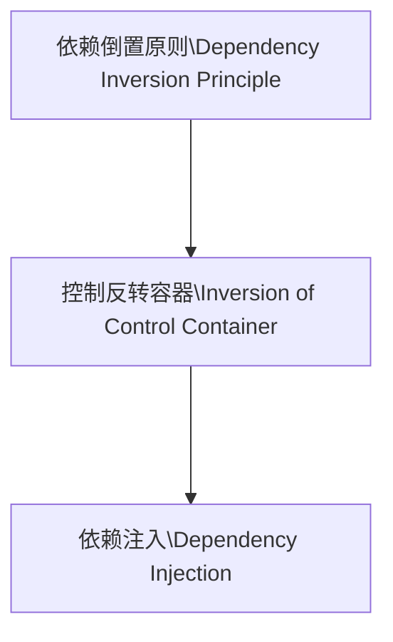

# Magic

[Toc]


## 简介

> ​		Use Standard C++ 11

> ​		基于IoC的快速开发库(C++ Rapid development library based on Inversion of Control),配合CMake构建套件开发.

## 特点

### 快速开发

- **高内聚,低耦合**.
- 超强的**通用性**以及高度**跨平台**.
- 实现**模块化**开发方式便于协作开发.
- 基于 IoC `(Inversion of Control)`的方式对每个类进行托管以及自动注入构建.

### 模块配置

- 功能模块可高度**重用**，方便**扩展**以及**维护**.
- 使用**Json**格式配置文件`(*.magic)`对功能进行模块划分.

### 非侵入式

- 代码**移植度**高.
- **无任何侵入式代码**.

- 高度解耦

### IoC  特点



## 示例

### 本库示例

> CMakeLists.txt

```cmake
set(MAGIC /home/magic/WorkSpace/Magic)
include_directories(
    ${MAGIC}
	${MAGIC}/Include
    ${PROJECT_SOURCE_DIR}
    ${MAGIC}/ThirdParty/Asio/Include
    ${MAGIC}/ThirdParty/RapidJSON/Include
)
link_directories(
    ${MAGIC}/Lib
)
link_libraries(Magic)
include(${MAGIC}/Magic.cmake)

#参数[1]:本库路径
#参数[2]:导出的头文件名
#参数[MGC]: 本库中的单模块(Module) or 多模块(Modules)
#参数[SRC]: 自定义的模块(Module) or 多模块(Modules)
GENEX(${MAGIC} Base MGC Magic SRC Base)

```

> 配置文件：[Magic模块](Magic.cmake)(可使用多个配置文件)
```
{ // 日志以及配置模块示例
    "Configurations":{
        "NameSpace":"Magic",// 同C++的namespace,若不想具有namespace留空即可.
        "Registered":[// 类信息注册.
            {
                "Id":"config",                          // 类Id标识(任意名),用于Initialize中使用.
                "Class":"Magic::Config",                // 类名,如果有namespace,则需加上即可.
                "IncludePath": "Include/Core/Config.h", // 类所在的文件路径.
                "Interface":"",                         // 继承的接口类,通常需要类似工厂模式的时候才使用.
                "Dependencies":[],                      // 依赖的其他类的类名.
                "FunctionPropertys":["addConfigFile"]   // 需要注册的属性函数.
            },
            {
                "Id":"configFile", // 与Magic::Config同文件,则不需要在此定义IncludePath
                "Class":"Magic::ConfigFile",
                "FunctionPropertys":["addFormatter"]
            },
            ......
        ],
        "Initialize":[// 初始化
            {
                "Id":"configFile",                          // 类Id标识应与上方Registered中一致.
                "FunctionPropertys":["setFilePath"],        // 需要初始化的函数.
                "FunctionArguments":{
                    "setFilePath" : ["\"./config.conf\""]   // 函数中对应的 RAW Arguments.
                }
            },
            {
                "Id":"logger",
                "Loop":true,                                // Loop 循环加入接口类对象
                "Callee":"Magic::ILogAppender",             // 接口类类型
                "FunctionPropertys":["addILogAppender"],    // 接口类对象添加函数.	
                "FunctionArguments":{}
            }
        ],
        "Constructor":{// 构造函数定义
            "Name":"Initialize",    // 暴露给main函数中调用名.
            "WithParameter": false  // 是否需要自定义注册参数.
        }
    }
}
```

> 本库将智能指针名称进行了重定义.
```c++
    #define Safe std::shared_ptr
```
> Config配置组件的使用用方法.
```c++
    /// 支持自定义扩展.
    /// 目前只支持基础类型和std::string.
    /// 未修改生成的配置文件的情况下,会使用at函数的第二个参数作为默认值.
    uint64_t number = Magic::Config::GetInstance()->at<uint64_t>("number", 24);
```
>Log日志组件的使用方法.
```c++
    /// 类 Log4j 日志库.
    /// 五种日志打印级别.
    /// 可通过配置中LogLevel调整日志输出等级.
    MAGIC_INFO() << "hello world";
    MAGIC_WARN() << "hello world";
    MAGIC_DEBUG() << "hello world";
    MAGIC_ERROR() << "hello world";
    MAGIC_FATAL() << "hello world";
```
### Other示例

> 目录位置:[Magic/Examples](https://github.com/INotfound/Magic/tree/master/Examples)

#### 简单的[Base](https://github.com/INotfound/Magic/tree/master/Examples/Base)示例

> CMakeLists.txt 引用Magic模块

```cmake
    GENEX(${MAGIC} Base MGC Magic SRC ...)
```
```c++
#include "Base.h"

int main(){
    Base::Initialize();
    MAGIC_DEBUG() << "hello world";
    return EXIT_SUCCESS;
}
```
#### WebServer示例

> TestSevlet.h
```c++
#pragma once
#include <Magic>

namespace Web{
    using namespace Magic::NetWork;
    /// 使用Magic::NetWork::Http::IHttpServlet进行Servlet注册.
    class TestServlet :public Http::IHttpServlet{
    public:
        TestServlet()
            :Http::IHttpServlet("",Http::HttpServletType::Deafult){
        }
        bool handle(const Safe<Http::HttpRequest>& request,const Safe<Http::HttpResponse>& response) override{
        }
    };
}
```
> main 函数
```c++
#include "Web.h"

int main(){
    Web::Initialize();
    return EXIT_SUCCESS;
}
```
> 自定义模块(Servlet.magic)
```json
{
    "Configurations":{
        "NameSpace":"Web",
        "Registered":[
            {
                "Id":"testSevlet",
                "Class":"Web::TestServlet",
                "IncludePath": "TestSevlet.h",
                "Interface":"Magic::NetWork::Http::IHttpServlet",
                "Dependencies":[],
                "FunctionPropertys":[]
            }
        ],
        "Initialize":[],
        "Constructor":{
            "Name":"Initialize",
            "WithParameter": false
        }
    }
}
```
> CMakeLists.txt
```cmake
    GENEX(${MAGIC} Web MGC Magic WebServer SRC Servlet)
```
## 其他

### 代码规范/联系方式
  - [C++](http://note.youdao.com/noteshare?id=0975fd51d320c1cd7bc0cbaab6d39e59&sub=AC10B1CBC6744F92B2B8A3F26DC47918)
- 作者联系方式

  - QQ: [614199451](http://wpa.qq.com/msgrd?v=3&uin=614199451&site=qq&menu=yes)
  - QQ群: [451405524](https://qm.qq.com/cgi-bin/qm/qr?k=qsjCo88_9j8cPCwkgzRzaIKfCyXU98VH&jump_from=webapi)